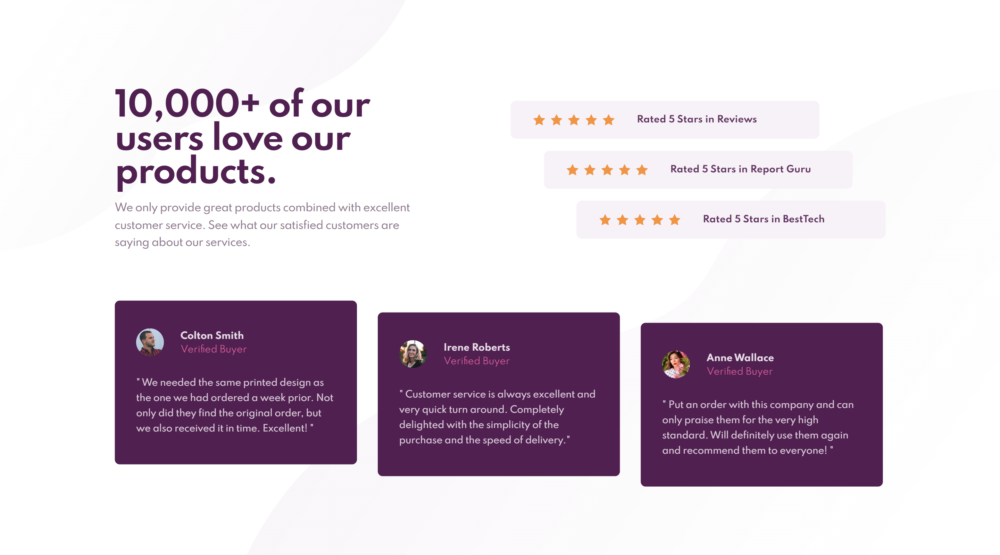
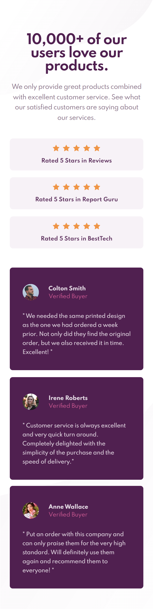

# Frontend Mentor - Social proof section solution

This is a solution to the [Social proof section challenge on Frontend Mentor](https://www.frontendmentor.io/challenges/social-proof-section-6e0qTv_bA). Frontend Mentor challenges help you improve your coding skills by building realistic projects. 

## Author

- Frontend Mentor - [@hcxweb](https://www.frontendmentor.io/profile/hcxweb)

### Screenshot

### Links

- Solution URL: [https://www.frontendmentor.io/solutions/social-proof-using-flexbox-iv3xbm3Mf]
- Live Site URL: [https://hcxweb.github.io/social-proof/]

### Built with

- Semantic HTML5 markup
- Flexbox